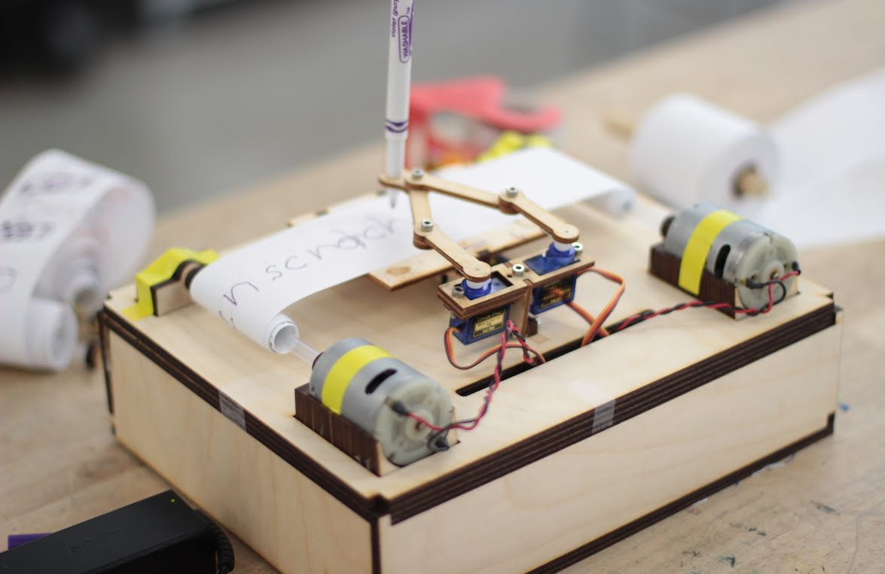

# Chicken Scratch
## A small interactive robot that handwrites short notes
UC Berkeley ME 102B: Mechatronics, Spring 2017 
Dilveen Goraya, Victor Tieu, Debleena Sengupta, Alex Walczak

 
 

 
   

<!-- Video link: -->
<!-- <iframe src="https://drive.google.com/file/d/0B6183kZa-7tDazhRMGVBSl9jV2s/preview" width="640" height="480"></iframe> -->

- There are two main components to our project: mechanical design and software implementation. 

- We used three servo motors to control the movement of the robot arms, as well as two DC motors to control the shifting of paper. 

- Our software linearizes the full forward kinematics of the robot, which we use to output joint velocities, and convert to servo positions. The software was embedded on an Arduino UNO microcontroller.

- We laser cut our own robot body and enclosure, connecting everything with screws and hot glue.

- All required code and fabrication files are hosted here on Github.

- Please feel welcome to check out our [project website](https://sites.google.com/view/chicken-scratch/) to find out more, and message us with any questions!

